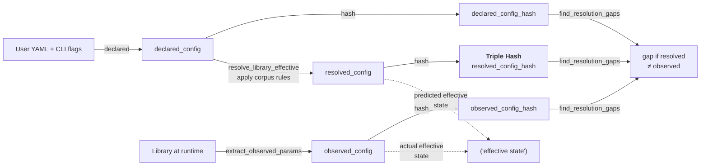

# Phase 50 Terminology: Declared, Resolved, Observed

## Overview

The feedback loop that drives corpus growth depends on three distinct stages of config representation: what the user declares (YAML), what our rules resolve it to (predicted effective state), and what the library actually does at runtime (measured effective state). The vocabulary here captures these stages precisely so that reviewers can reason about gaps in our corpus coverage. The term "effective state" is the abstract goal — the library's actual runtime behaviour — while "resolved" and "observed" are two ways of approximating it (one predicted, one measured).

## Pipeline



## The Three Stages

### Declared Config

**Source**: User YAML + CLI overrides, before any normalisation.

**What it represents**: The user's intent, exactly as written. This is the primary key for the study — each declared config is independent. 

**Where it lives**: Sidecar `measure.jsonl` as `{"declared_config": {...}, ...}`, persisted at the point of study resolution.

**Stability**: Immutable once the study begins; the feedback loop never rewrites a declared config.

### Resolved Config

**Source**: Apply all vendored rules from the corpus to the declared config. The `resolve_library_effective()` function performs this transformation, substituting any params that the corpus has learned the library will ignore, normalise, or override.

**What it represents**: What we predict the library will do with this declared config, based on our current corpus of discovered rules. It is a *forecast* of effective state.

**Where it lives**: Sidecar `measure.jsonl` as `{"resolved_config": {...}, ...}`, computed at the start of each measurement.

**Stability**: Changes whenever the corpus is refreshed (new rules land). If you rerun an old study against a newer corpus, the resolved configs may differ.

### Observed Config

**Source**: After the library loads and initialises, we extract the actual runtime parameters via `extract_observed_params()`. This reads the internal state of the initialised engine object (Pydantic model dump, dataclass `asdict`, `__slots__` iteration, fallback to `__dict__`).

**What it represents**: The library's *actual* effective state for this run, observed post-construction. It is ground truth.

**Where it lives**: Sidecar `measure.jsonl` as `{"observed_config": {...}, ...}`, captured after engine init.

**Stability**: Fixed for a given library version and input. Changing the library version may change the observed state; changing the corpus does not.

## The Effective State Concept

**"Effective state"** is the abstract idea: *what does the library actually use at runtime?*

This is what we measure and want to understand. But it is not itself a concrete data structure — it is the intent of both `resolved_config` (prediction) and `observed_config` (measurement).

In prose, we freely say "the library's observed effective state" or "extract the effective parameters" — that usage is correct. In code, we avoid naming a variable or function `effective_*` because it is too vague (effective to whom? the resolver, the extractor?). Instead, code uses:

- `resolved_*` for corpus-predicted state
- `observed_*` for measured state

The split is load-bearing: reviewers need to see both sides to validate a resolution gap (the diff between what we predicted and what was real).

## The Hash Triad

Three hashes identify configurations at three levels of abstraction:

| Hash Name | Input | Produced By | Proves | Stored Where |
|---|---|---|---|---|
| `declared_config_hash` | `declared_config` as-is | `compute_declared_config_hash()` | User intent is stable across reruns | sidecar `measure.jsonl` |
| `resolved_config_hash` | `resolved_config` post-rules | `compute_resolved_config_hash()` | Our corpus correctly predicted effective state | sidecar `measure.jsonl` |
| `observed_config_hash` | `observed_config` post-extract | `compute_observed_config_hash()` | Library actually used this state | sidecar `measure.jsonl` |

When `resolved_config_hash == observed_config_hash`, the corpus is correct for this declared config: we predicted right.

When they differ, the library normalised/ignored/overrode something we didn't encode. That's a **resolution gap** — our corpus is incomplete.

All three hashes are SHA-256 digests of a JSON serialisation (full dict, sorted keys, IEEE 754 float normalisation to 12 significant figures).

## Resolution Gaps

A **resolution gap** is detected when:

```
declared_config_hash = X
resolved_config_hash = Y
observed_config_hash = Z
where Y ≠ Z
```

This means: for the declared config X, our corpus rules resolved it to Y, but the library actually used Z. The gap is the unknown transformation from Y to Z.

**Why gaps matter**: The feedback loop uses gaps as evidence that the corpus is incomplete. Each gap triggers a rule proposal (via `llem report-gaps`). Corpus reviewers evaluate proposals, author new rules, and land them. Over time, gaps close as the corpus grows.

**Gap closure**: When a gap closes, it means we've authored a rule that explains the Y → Z transformation. The rule becomes part of the corpus; future runs with this corpus will have `resolved_config_hash == observed_config_hash` for the same declared config.

## Collision vs Contrast Partitioning

When a resolution gap is detected, we must understand what the library did differently. The evidence bundle partitions the study's declared configs into two sets:

**`collision_configs`** — all declared configs that landed in the same `observed_config_hash` group as the gapped config. These configs triggered the same library normalisation, so their observed states are identical. They are evidence that the normalisation is systematic, not accidental.

**`contrast_configs`** — all other declared configs in the run that landed in different `observed_config_hash` groups. These serve as negative controls: they avoided the normalisation, proving that the gap is conditional (depends on specific field values, not all inputs).

**Authorship signal**: Reviewers compare the field-value distributions across collision and contrast sets. The fields where collision configs cluster (but contrasts scatter) are the predictors of the normalisation. These become the rule's predicate; the normalised values become the rule's kwargs.

## Deprecated Terminology

- **`canonicaliser`** (noun/concept): Replaced by "library-resolution mechanism". The concept survives in prose as "the corpus resolves configs", but `canonicaliser` was imprecise (did it mean the resolver? the verifier? the gap detector?). All gone.

- **`H1`, `h1_hash`, `h1`** (numeric hash naming): Replaced by `resolved_config_hash`. H1 was shorthand; the full name clarifies what the hash covers.

- **`H3`, `h3_hash`, `h3`** (numeric hash naming): Replaced by `observed_config_hash`. H3 was shorthand for "hash 3 = the hash the library observes".

- **`effective_*` as code noun** (e.g. `effective_engine_params`): Replaced by `observed_*` (runtime params) or `resolved_*` (corpus-predicted params). The word "effective" remains in prose ("extract the effective parameters"), but code avoids it as a noun because it's ambiguous.

- **`fired_configs`**: Replaced by `collision_configs`. "Fired" was jargon (meant "matched the gap condition"); "collision" is precise (these configs collided into the same observed hash).

- **`not_fired_configs`**: Replaced by `contrast_configs`. "Not fired" was imprecise; "contrast" clarifies they serve as controls.

## Glossary

- **`declared_config`** — User-provided config (YAML + CLI) before any normalisation. The study's primary key.

- **`resolved_config`** — Config after applying the corpus rules. Predicted effective state.

- **`observed_config`** — Config extracted from the initialised library. Actual effective state.

- **`effective state`** — The abstract runtime behaviour of the library (what it actually uses internally). Both resolved and observed configs attempt to describe it.

- **`declared_config_hash`** — SHA-256 of declared config. Stable across reruns; identifies user intent.

- **`resolved_config_hash`** — SHA-256 of resolved config. Changes when corpus is refreshed; identifies corpus coverage.

- **`observed_config_hash`** — SHA-256 of observed config. Changes only with library version; identifies actual library behaviour.

- **`resolve_library_effective()`** — Function that applies corpus rules to transform declared into resolved config. The feedback loop's *predictor*.

- **`extract_observed_params()`** — Function that reads the initialised engine and extracts the observed config. The feedback loop's *verifier*.

- **`resolution gap`** — Mismatch between `resolved_config_hash` and `observed_config_hash` for the same declared config. Evidence that the corpus is incomplete.

- **`collision_configs`** — Declared configs that landed in the same `observed_config_hash` group during a gap. Evidence of systematic normalisation.

- **`contrast_configs`** — Declared configs that landed in different `observed_config_hash` groups (negative controls). Help identify the gap's predicates.

- **`library-resolution mechanism`** — The feedback loop that uses observed gaps to propose and refine corpus rules. Replaces "canonicaliser".

- **`equivalence_groups`** — Set of configs that hash to the same `observed_config_hash`. The library treats them identically at runtime.

- **`walker`** — AST-parsing code that discovers rules from library source. Part of the vendor-CI pipeline (runs on library import).

- **`vendored rules corpus`** — YAML file (`configs/validation_rules/{engine}.yaml`) containing all discovered rules. SSOT for what we know about the library.

- **`canonicaliser` (deprecated)** — Replaced by "library-resolution mechanism" or the specific function names `resolve_library_effective`, `extract_observed_params`, `find_resolution_gaps`.

- **`H1` (deprecated)** — Replaced by `resolved_config_hash`.

- **`H3` (deprecated)** — Replaced by `observed_config_hash`.
